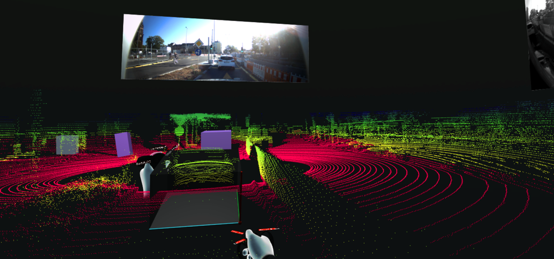
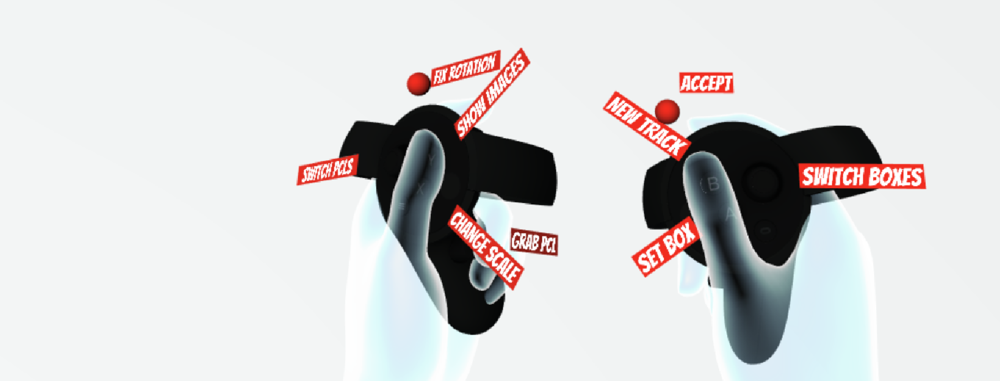

# PointAtMe

#### A 3D Label Tool for Annotating Point Clouds with Oculus VR

## Overview

In this 3D Label Tool the user utilizes Oculus VR in order to label and annotate various traffic participants. The user is placed into the scene and can move around, identifying traffic participants. Information about these, for example about the type of traffic participant and in which direction the traffic participant is moving relative to the ego vehicle, can be defined.


## Installation

1.  Ensure that you have an Oculus Rift and two Oculus Touch Controllers at your disposal. [Create an account](https://secure.oculus.com/sign-up/) in Oculus and download the program [here](https://www.oculus.com/setup/). Make sure that you download the program applicable to your Oculus device.

2.  [Create a Unity ID](https://unity3d.com/de/unity/editor) and download a version of the Unity Editor. We recommend using the version Unity 2017.4.8 (this and other versions can be found [here](https://unity3d.com/get-unity/download/archive)) as this was the version used to develop this tool.

3.  Download the files from this repository (for example as a zip in which case you can extract the files to your computer).

4.  Download Oculus Integration [here](https://developer.oculus.com/downloads/package/oculus-utilities-for-unity-5/1.26.0/) and save the file in a location that you can remember.


## Setting up the Label Tool

1.  Open **Unity Editor** and create a new project. Make sure to use the 3D Template. You can name the project however you want to and save it in a location that makes sense to you (make sure to remember the file location!). Create the project.

2.  Once **Unity Editor** has opened the project you can see the basic unity scene. You should see the tabs **Scene**, **Game** and **Asset Store** just above the basic unity scene. Below and to the left of this scene you should be able to see the tabs **Project** and **Console**. These will be important at a later stage.

3.  Minimize **Unity Editor** and go to the folder where your new unity project is saved. Copy the folders **3DLabelAsset**, **ImportPointCloudAsset** and the file **scene_1.unity** (that you have downloaded from this repository) to the folder **Assets** of the new unity project.

4.  Add another folder named **RecordedData** to the **Assets** folder (it’s technically not an asset, it’s just a folder where the data lies). In the folder **RecordedData** create five further folders named **pcd**, **front**, **rear**, **left** and **right**. The **pcd** folder will contain all the point clouds and make sure to **only use .pcd files in ASCII format**. The remaining four folders contain images of the corresponding cameras. **Only use .png files** in these folders.

5.  Re-open **Unity Editor** and go to the **Project** tab that you have seen before (in step 2 of setting up the label tool). In the folder **Assets** you should be able to see **scene_1**. Double click on this to open the scene in unity. 

6.  You have to change the variable **path**. This can be found in the **Assets** folder of the **Project** tab of **Unity Editor** (which you should have seen in step 2 of the setup process). To change the variable, you have to click on the folder **3DLabelAsset** -> **Scripts**. Once there, open the program **LabelToolManager**. You must change the variable **path**  (this should be within the first 10 lines of code) to match the file location of your unity project. Be sure to add a slash **/** at the end of the file location. 

7.  Finally, to import the asset **Oculus Integration**, go to the menu bar and click on **Assets** -> **Import Package** -> **Custom Package**. Go to the folder where you downloaded the oculus integration asset (in step 4 of the installation process) and select **OculusUtilities.unitypackage** in the folder **OculusUtilities**. Import all parts of the asset.

8.  If you click **Play** now, there might be a notification in your oculus rift that says that unknown sources currently aren't allowed. To bypass this error, open the program **Oculus** and ensure that you allow unknown sources to run on Rift. You can do this by going to the **Settings** -> **General** and making sure that **Unknown Sources** are allowed.

9.  *(Optional)* In the program **ShowImages** (that can be found in the same location as **LabelToolManager** from step 6 of the setup process) you can change the variables **ratio** and **Scale** to specify the size of the images shown. It might take a few tries to find an image size that works for you. This step is optional as there is already a standard size the images are set to.


## Using the Label Tool

You can start the tool by hitting `Play` in Unity Editor. When you place your Oculus VR over your head, you can see the first point cloud of the sequence around you and might be able to recognize shapes that belong to pedestrians or cars. Have a look at your controllers. You can see them and an estimated shape of your hands can be seen around your controllers. We added descriptions of the functionality of each button so you don't have to keep their function in mind. However, we expect any annotator to remember them after a short period of labeling time.


We separated the functionality of the Oculus Touch Controllers in a way we hope is intuitive and well structured. The left controller has functions related to understanding the scene. You can scroll through the sequence, turn the scene or fix the dummy box in your hand. With the right controller, you enforce the actual labeling tasks. You can set tracks and boxes, choose a track you would like to modify and work yourself through dialogs defining meta information about the traffic participant. Tracks are used to give the user information about the vehicle that is being labeled. 

With the `left hand trigger`, which you can reach with your middle finger, the point cloud can be grabbed, turned and shifted. Try to familiarize with the scene and turn the point cloud in a way so you can clearly see a traffic participant in front of you. Now press and hold `Y` on your left controller. Four images taken in the current scene appear. Make yourself familiar with the scene. Would you understand the traffic rules that apply in the current scene? If not, diving through the sequence may help you in order to do so. Push the `left thumbstick` to the right in order to switch between the point clouds. To go back to the first scene, push it to the left. Each use of the `left thumbstick` increases or decreases the current sequence index by exactly 1, so it might take a while to have a look at the whole sequence.

Now that you understand the traffic scene, press `B` on the right controller in order to create a new track. The New Track Dialog pops up. Choose the options that apply to the traffic participant that you would like to annotate by pushing the `right thumbstick` up or down. If the desired answer is selected, pull the `right index trigger` with your index finger. After answering all questions you can start annotating the first track. The counter in the upper left shows how many tracks you have already created and which track you are currently working on. Place both of your controllers in a way so that the reshapeable box completely surrounds every point that belongs to the object. The red spheres define two diametrical corners of the box. The coordinate axes that stick to the red sphere on the right controller define the orientation of the box. Your left hand therefore only influences the size and the position of the middle of the box but not its orientation. If you want to fix the roll and the pitch angle of the box, press the `left index trigger`. As soon as the box is in the desired position, press `A` on your right controller in order to set the box. Turn the scene to check whether all points are within the box. You can modify a cuboid as long as it is red. If you are not satisfied with its position, place another box at a random position in space to receive a good view of the points on the surface of the object again. Now you can place a box that fits to the object better than the first one.



Let's have a closer look at the reshapeable dummy box, how it is visualized and how the two red spheres around it define the box. The walls of the box are tinted dark but is still transparent, so you can clearly see whether a point that belongs to an object unintentionally leaves the box. Also have a look at the symmetry of the points of the object. In some cases the human annotator has to guess the scale of the object and it is recommended to do so by assuming a symmetric shape with respect to the longitudinal vehicle axis. Now go through the whole sequence and look for the object you are currently labeling. Annotate it, until it does not occur in the point cloud any more. The detections do not have to be in every single frame and not even in a closed sequence. If a vehicle disappears behind a truck for example, skip a few frames and keep annotating the object when it appears again. Set a box by pressing `A` on the right controller. After any annotation, you are asked for the quality of the box. 

If you are satisfied with your track, press `B` again and continue with the next track. You can switch between existing tracks by pushing the `right thumbstick` to the left or to the right. The number of the current track will change accordingly. Labels are saved each time you change the point cloud. If you return to a point cloud where you already annotated objects, these objects will be recreated. If you are satisfied with the labels of the whole sequence, just hit the Play button again or stop the running program if you ran the tool by building it. The labels are saved within the `Labels` folder that is found within the `Assets` folder.


## Keys and their Function

| key | function | 
|-------:|:-------| 
| **left thumbstick** | switch between scenes |
| **left hand trigger** | grab pointcloud |
| **left index trigger** | only allow 1D rotation around Y axis / reset pointcloud rotation |
| **X** | change the scale of the image |
| **Y** | show camera images |
| **right thumbstick** | switch between set boxes |
| **right index trigger** | accept dialog |
| **A** | set a new box within the current scene |
| **B** | create a new track |




## Citation

If you are using PointAtMe for scientific research, we would be pleased if you would cite our publication:
```latex
@inproceedings{,
  title     = {PointAtMe: Efficient 3D Point Cloud Labeling in Virtual Reality},
  author    = {Wirth, Florian and Quehl, Jannik and Ota, Jeffrey and Stiller, Christoph},
  booktitle = {Proc.\ IEEE Intelligent Vehicles Symposium},
  year      = {2019},
  address   = {Paris, France},
  owner     = {florianwirth},
  month     = {June},
}
```


## Contributors

Florian Wirth

Maqsood Rajput

Konstantin Tsenkov

Justin Knipper
